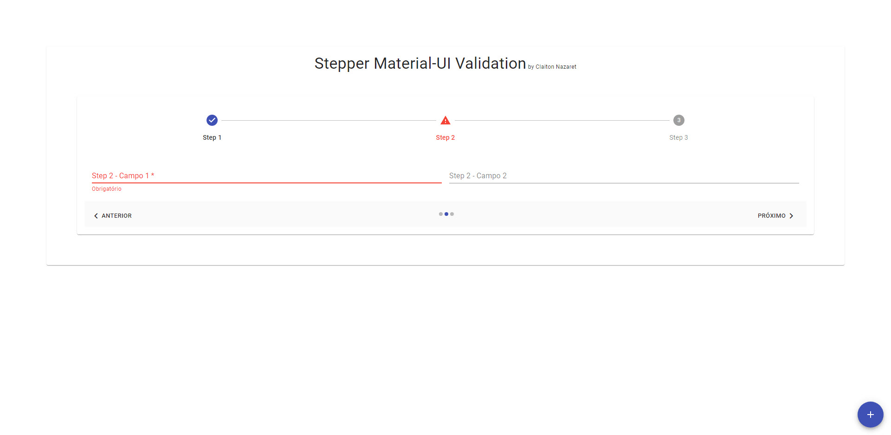

# Stepper Material-UI Validation

This project was bootstrapped with [Create React App](https://github.com/facebook/create-react-app).

Component created to validate individual steps that have invalid fields

Example CodeSandbox [here](https://codesandbox.io/s/steppermaterialvalidation-g4orh)

## Frameworks
To learn Material-UI, check out the [Material-UI](https://material-ui.com/pt/).

To learn React, check out the [React documentation](https://reactjs.org/).

To learn React-Final-Form, check out the [React-Final-Form](https://final-form.org/react).